# 一、下载客户端

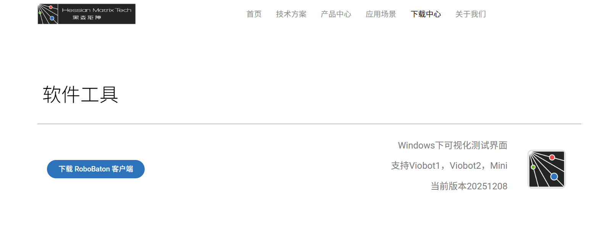

# 二、开机（对应用户手册开机指南）
### 1、上电：
	网线加自带的电源线
	
### 2、配置网络：

1. 修改电脑IP设置：
	- 按下键盘上的 **Win + R** 键，打开“运行”对话框。
	- 在输入框中输入 `ncpa.cpl` 然后按**回车**。
	- 这样会直接跳出图片左下角那个“网络连接”窗口（列出 WLAN 和以太网的那个）。
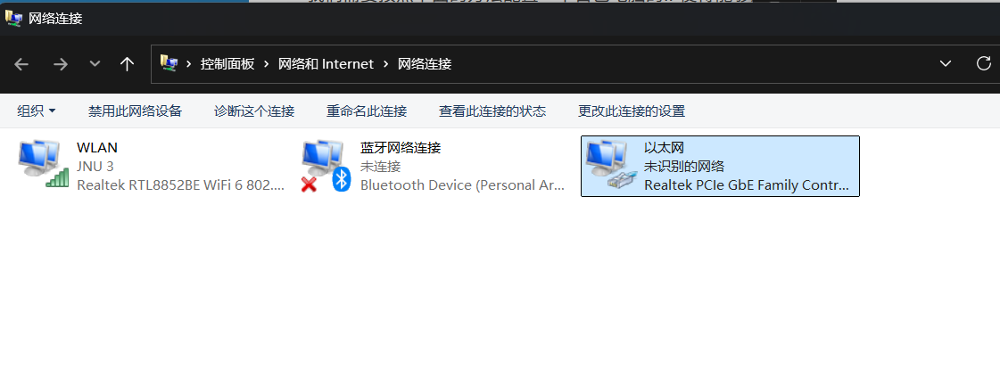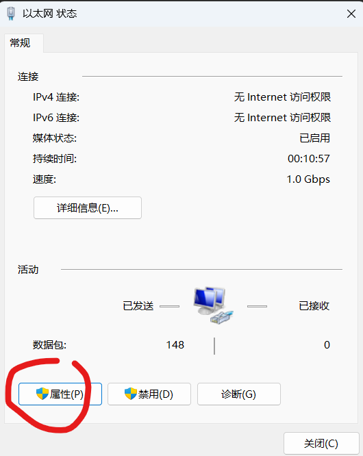
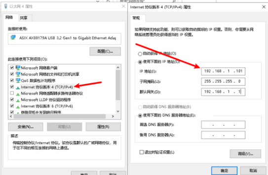
IP地址：192.168.1.101
子网掩码：255.255.255.0（点一下应该会自己出来）
默认网关：192.168.1.1

### 3、配置网络：

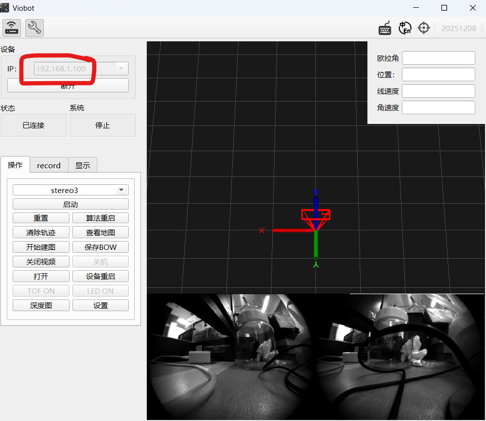==注意这里的IP是192.168.1.100！！！==
### 4.ssh连接
	用户名：root
	密码： PRR
- 按下 **Win + R**，输入 `cmd` 或 `powershell` 并回车。
- 输入以下命令（注意空格）： `ssh 用户名@设备IP`
    ```
ssh root@192.168.1.100
    ```
- **首次连接提示：** 屏幕会显示一段文字，问你是否信任这台设备（Are you sure you want to continue connecting?），输入 **`yes`** 并回车。
- **输入密码：** 接着会提示输入密码。
    - **注意：** 在终端输入密码时，屏幕上是**不会显示任何字符**（连星号都没有）的，你只管输完按回车就行。
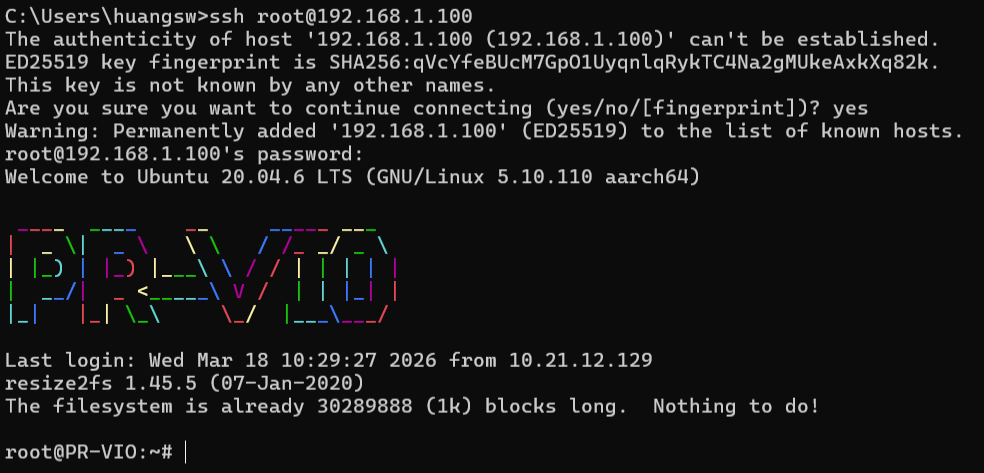
### 5.启动测试
选择stereo3，再点击启动键
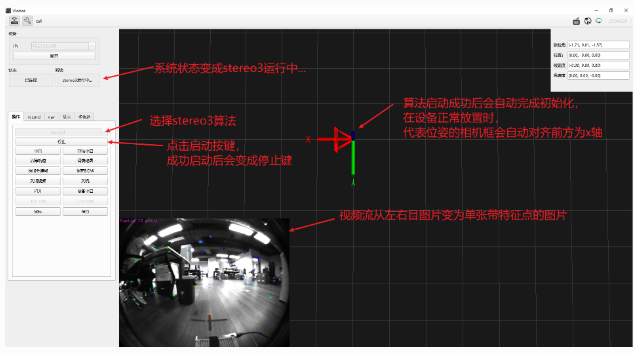
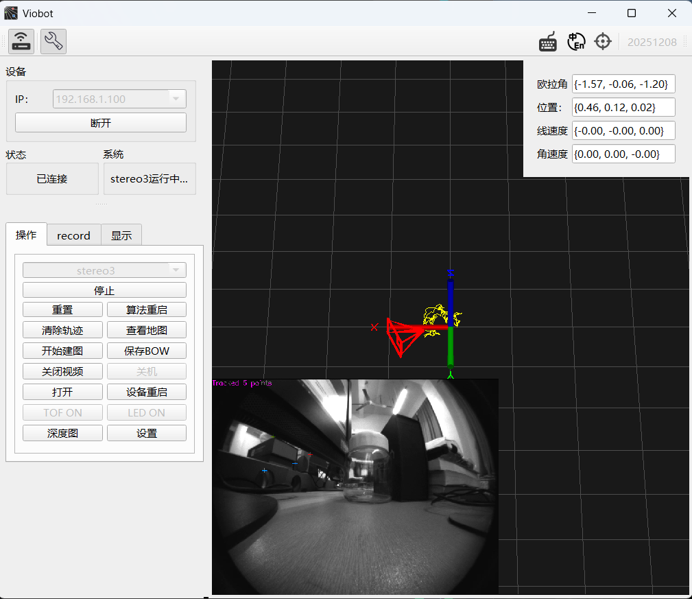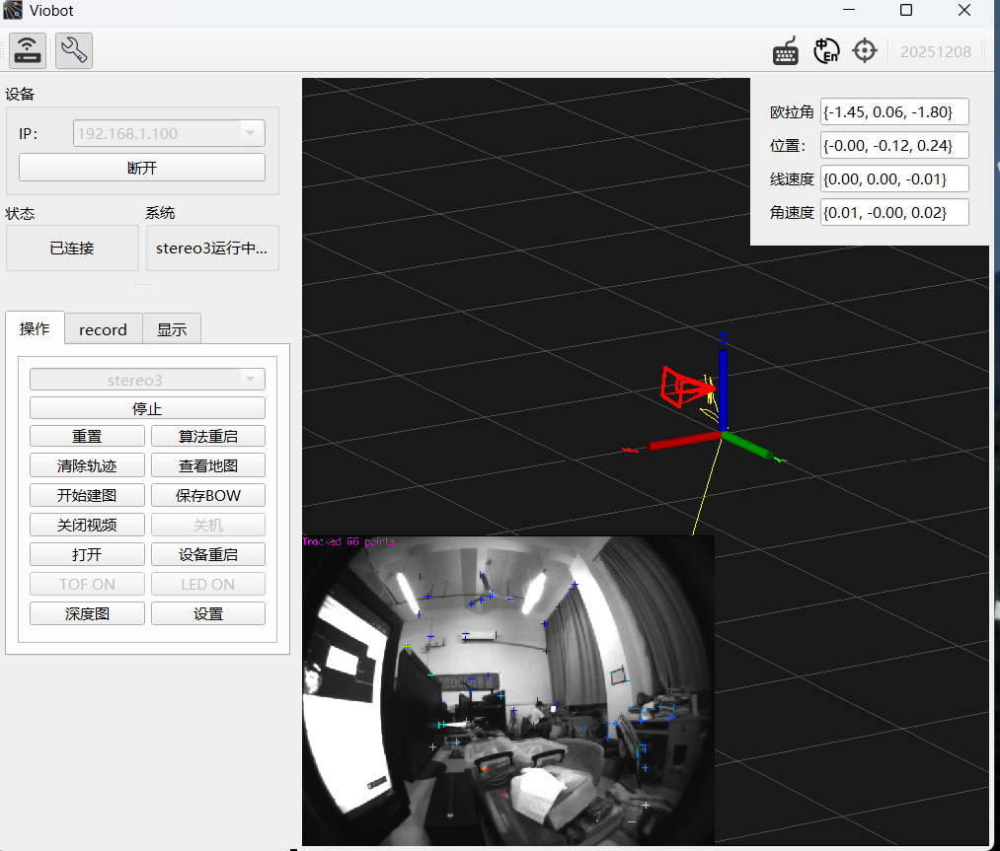

|**模式名称**|**图像拼接方式 (Layout)**|**特点与用途**|
|---|---|---|
|**stereo3**|**左右拼接 (Side-by-Side)**|最常见的模式。左眼和右眼的图像被拼成一张宽图（例如两个 640x480 拼成一个 1280x480）。**适合大多数 SLAM 算法直接调用。**|
|**stereo4**|**上下拼接 (Top-Bottom)**|将左眼和右眼的图像上下叠放。这种模式在某些特定的硬件解码器或老旧的显示协议中更节省带宽或处理开销。|
### 7.设备坐标系定义
stereo3算法开启后，会自动完成双目初始化。算法输出的里程计平移为X轴朝前Z轴朝上Y轴朝左，旋转为Z朝前X朝右Y朝下，相机原点归到左目上面。点云坐标系与相机一致。

# 三、基本功能

### 1、设备连接状态
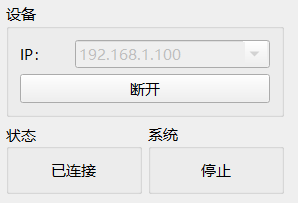

输入设备IP或者是通过自带的局域网设备搜索功能给到正确的IP之后，点击连接，连接成功后连接按键会变成断开键。同时状态框显示为已连接状态，无连接则会显示已断开。
系统框显示的是设备当前算法状态，

此时它的系统的算法状态是停止状态的，这个系统状态有三个状态：
1）停止
2）stereo3初始化中
3）stereo3运行中

### 2.操作栏
### 1.常规操作

首先是操作页面，包含了stereo3算法的启动、停止、重启和重置(注：重置不会清掉已加载到内存的词袋地图)

- 清除轨迹：清除UI当前显示的轨迹和点云。
- 查看地图：查看保存的bow关键帧的位姿。
- 开始建图：保存bow后重建用于重定位的图。
- 保存BOW ：将本次运行生成的词袋地图保存到指定路径。
- 关闭视频 ：关闭UI视频流显示。
- 设备重启：点击按钮后，整个设备系统会直接重启，用于一些配置向修改生效。
- 坐标 ：设备当前位姿显示。
- 设置：调出设置页面
### 2.record操作页


1. 用于设备录制rosbag，Cam+IMU勾选会录制传感器的数据，算法开启后algo_result勾选会录制算法运行过程产生的结果。

2. 数据包保存路径：需要填设备的绝对路径，如：`/home/user/` 注：保证路径存在前后斜杠要有

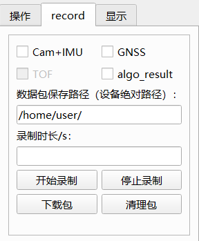
3. 录制时长：设置录包的时间长度，单位为s。须注意录制的数据包的大小，传感器数据30s大概是 280M左右。

4. 补充说明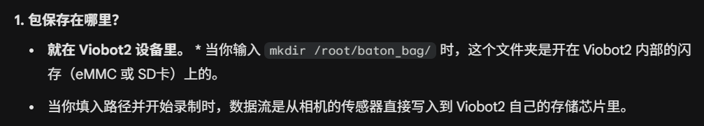
### 6. 设置页面
#### 2. loop
一样的新建一个文件夹用于存放BOW(词袋地图），可以建小的文件夹存放不同的文件。
**mask路径：** 这个通常可以先**留空**。它一般用于设置“遮罩”，比如屏蔽掉画面中机器人自身的机械臂或者某些会干扰算法的动态区域。

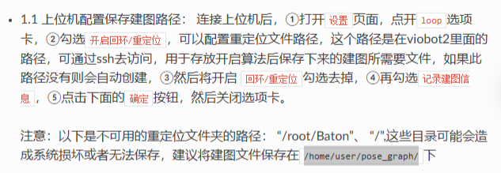

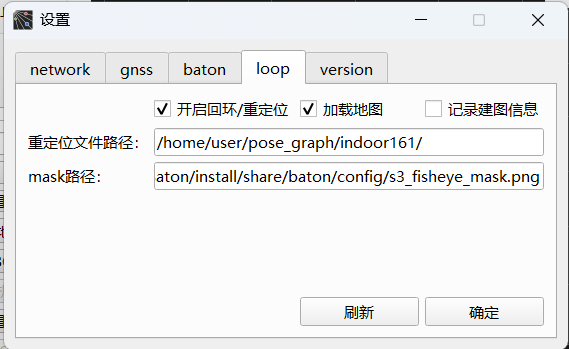
回环设置：

开启回环/重定位：在使用历史词袋地图时，勾选会自动加载下面路径下的词袋地图，并且算法运行时自动添加关键帧。（此功能也用于重定位的数据采集）
重定位文件路径：设置保存词袋地图的路径。注意：该路径是在设备上的。

### 3.baton


相机的基本设置

- imu频率：默认200Hz，现最高支持400Hz，没有特殊需求一般不建议修改。
- image频率：相机帧率，PRO版25fps，最高40fps。
- 自动曝光：前面的勾勾上则开启自动曝光，根据下面设置的常规亮度来调节相机成像亮度，如果不需 要自动曝光，则将勾去掉，单独设置下面的曝光时间。
- 深度图：HM_INSIDE应用，勾选后能用左右双目计算出视野中的深度信息，具体查看HM_INSIDE应用；
- 自动增益：前面的勾勾上则开启自动增益，该功能在场景特别暗的时候好用，但在一般场景下，开启 自动增益可能会影响算法精度。
- 曝光时间：曝光时间在去掉上面的自动曝光的勾时可设置，如果要用到这个设置，可能需要用户自行 根据不同设置值下的成像表现来设置，属于经验值。调大图片 会变量，调小会变暗，取值 范围：1~65535。
- 增益等级：自动增益勾去掉时可设置，推荐值1，如果画面太暗，效果不佳可设置为2。
- 常规亮度：推荐室内：80~95;室外：120~135；根据画面亮度手动调节。
- namespace: 设置当前相机的话题前缀，默认为baton。
- DOMAIN_ID: 用于设置ROS2多机通信里面的domain_id，默认为-1，不启用。 （注：ROS版本是没有这个设置的）