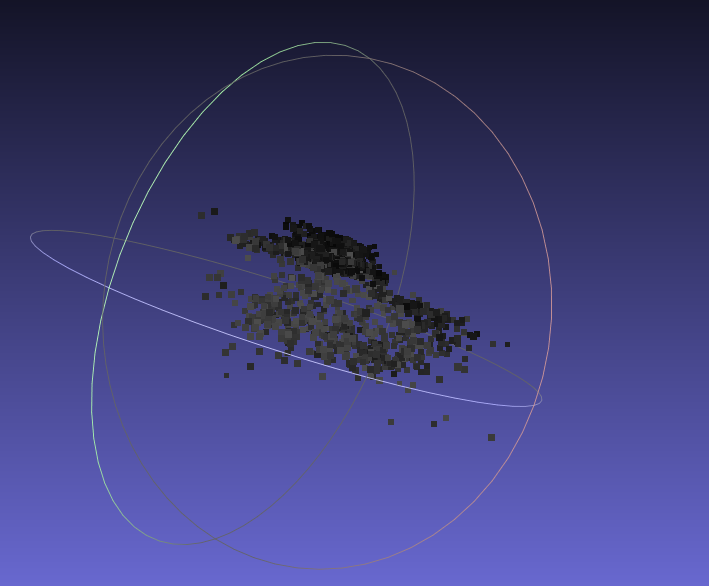
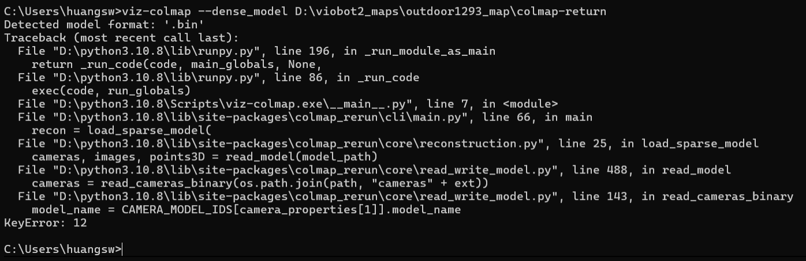
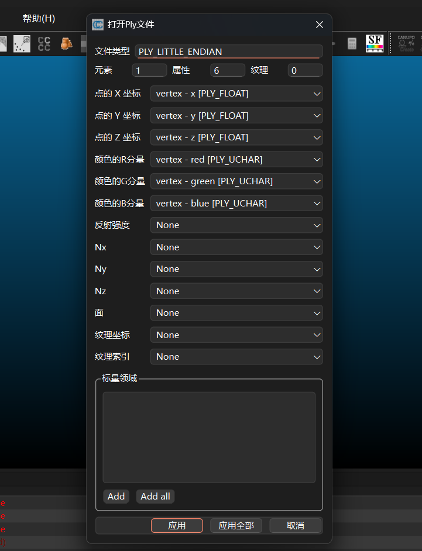
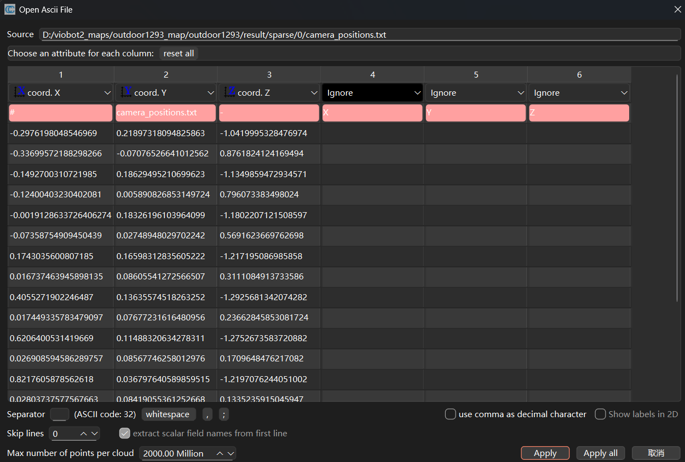
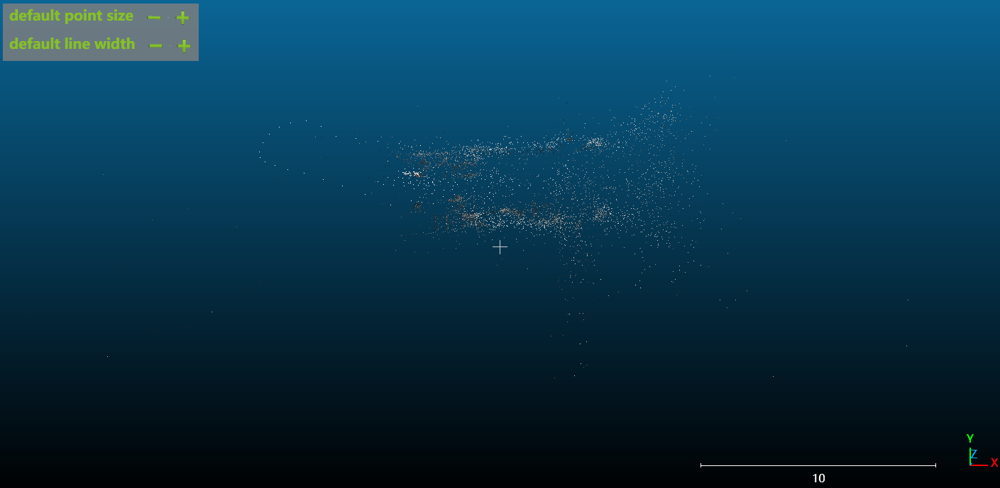
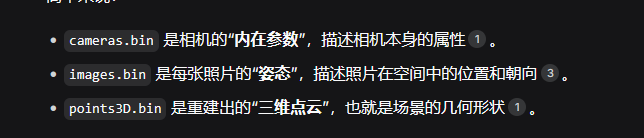
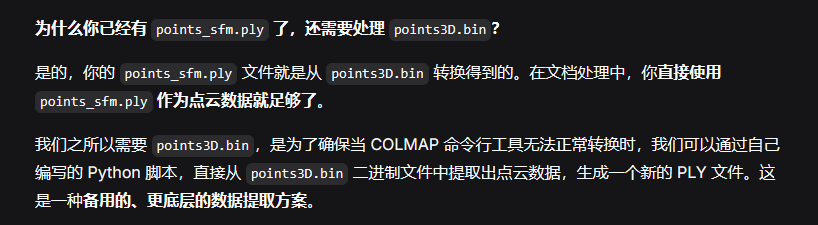

# 将建图文件传到电脑
### 第一步：在 Viobot2 上压缩建图结果
```bash

# 进入建图结果目录
cd /home/user/pose_graph/
# 压缩整个 indoor161 文件夹
zip -vr indoor161_map.zip indoor161/
```

### 第二步：查看压缩文件
```bash

# 确认压缩文件已生成
ls -lh /home/user/pose_graph/indoor161_map.zip
```
应该显示类似：
```text

-rw-r--r-- 1 root root 15M Mar 27 23:00 indoor161_map.zip
```

### 第三步：传输到 Windows 电脑

### 用 scp 命令

在 Windows PowerShell 中执行：
```powershell

scp root@192.168.1.100:/home/user/pose_graph/indoor161_map.zip D:/viobot2_maps/
```

### 第四步：在 Windows 上解压

1. 找到下载的 `indoor161_map.zip`
2. 右键 → **解压到当前文件夹** 或 **解压到 indoor161_map**
3. 解压后得到 `indoor161/` 文件夹，里面有：
    - `result/sparse/0/cameras.bin`
    - `result/sparse/0/images.bin`
    - `result/sparse/0/points3D.bin`
    - `pose_graph.txt`
    - 等等


# MushLab
1.  下载 MeshLab：[https://www.meshlab.net/](https://www.meshlab.net/)
2.  安装后打开
3. `File` → `Import Mesh` → 选择：
```    text
    D:\viobot2_maps\indoor161_map\indoor161\result\sparse\0\points_sfm.ply
```

4.  就能看到 3D 点云，可以旋转、缩放

窗口**右侧** `Points` 或 `Point Size` 的滑块，可以调节点的大小
]由于我是坐着转动设备，所以我靠近 的一侧点云比较密集

# colmap-return

这个报错的核心意思是：**`colmap-rerun` 这个可视化工具，不认识你 `.bin` 文件里记录的那种相机模型**。

简单来说，你的数据是用一种编号为 `12` 的相机模型生成的，但 `colmap-rerun` 内置的相机模型列表里，编号只到 `5`。就像你用了一个新版软件保存的文件，去让一个旧版软件打开，它不认识新格式，所以报错了。

### 💡 为什么会这样？

COLMAP 为了支持各种相机，内置了一个相机模型“字典”[](https://deepwiki.com/Vincentqyw/colmap-rerun/4.3-reconstruction-data-module)。报错中的 `KeyError: 12` 就表示，它只认识 `0` 到 `5` 的模型编号，但你数据里的是 `12`。

这说明，你的数据可能是用较新版本或自定义版本的 COLMAP 生成的，而 `colmap-rerun` 这个工具还没来得及更新它的“字典”去支持这些新模型。

# CloudCompare
1. 直接将ply文件拖进来，点击应用
2. 打开命令提示符 (cmd)，输入并执行以下命令
   ``` bash
    "D:\COLMAP\cuda\COLMAP.bat" model_converter --input_path "你的bin文件所在的文件夹路径" --output_path "你想保存txt文件的文件夹路径" --output_type TXT
   ```
3. 创建脚本`read_write_model.py`和 `extract_cameras.py`
4. cmd运行
   ``` bash
   python D:\viobot2_maps\extract_cameras.py
   ```
5. 直接把camera_positions拖进来注意上面六栏依次为：x y z ignore ignore ignore

为什么只处理了相机的位置
